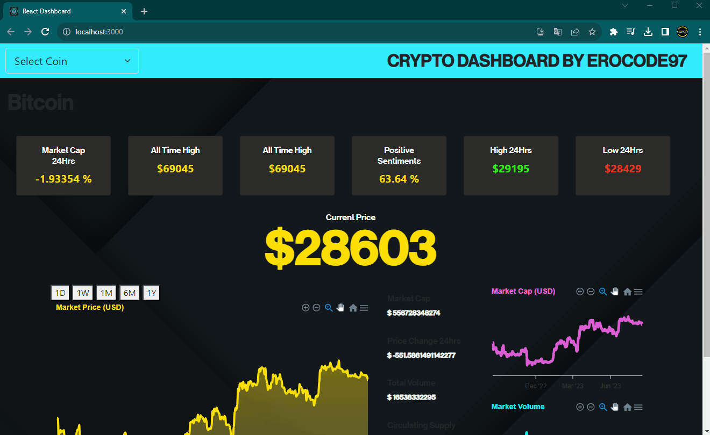

📊 Introducing a Live Cryptocurrency Dashboard built with React.js! 📈🪙

In this project, I've harnessed the power of React.js to create an interactive dashboard that displays real-time cryptocurrency market data fetched from the CoinGecko API. 📡💰 With the incredible React-ApexCharts.js library, I've brought this data to life through stunning charts and graphs that capture market trends and insights.

🔥 What's Inside:

Dynamic UI Components: React's component-based architecture makes it a breeze to create a structured and modular dashboard design.

Real-Time Data Fetching: I've delved into API integration to pull live cryptocurrency data and keep users informed about the latest market changes.

Beautiful Data Visualization: React-ApexCharts.js has enabled me to present complex data in a visually appealing manner, providing users with an intuitive way to understand market trends.

🎯 Whether you're new to React.js or a seasoned developer, this project offers something for everyone. It's a fantastic way to learn about APIs, data visualization, and crafting engaging user interfaces.

Stay tuned for more updates as I put the finishing touches on this exciting endeavor! 🎉📊

